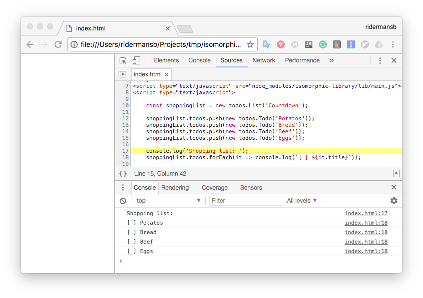

[](https://travis-ci.org/Ridermansb/isomorphic-library)
[](https://www.npmjs.com/package/isomorphic-library)

> Isomorphic library sample with WebPack




Live view [in node][1] and <a class="jsbin-embed" href="https://jsbin.com/soqafigitu/embed?js,console">browser</a><script src="https://static.jsbin.com/js/embed.min.js?4.0.4"></script>

# Get starter

**Install dependencies and build library**
```  
npm install
npm run build
npm link
```

**Use demo**
```  
cd demo
npm install
npm link ../
``` 
**Check the results**  
 1. Inside the demo folder `node index.js`
 2. Open `index.html`

## Others examples

 1. https://github.com/krasimir/webpack-library-starter
 
 [1]: https://runkit.com/ridermansb/isomorphic-library-sample/1.0.0
 [2]: 